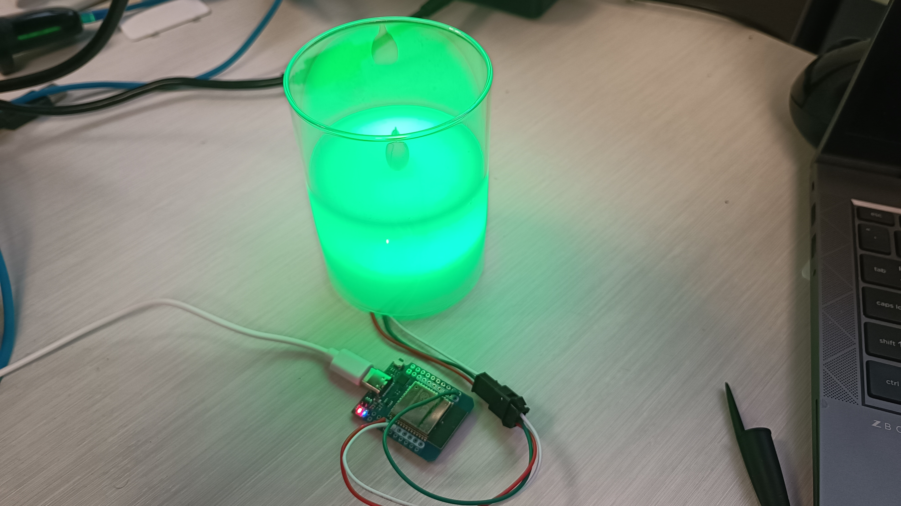
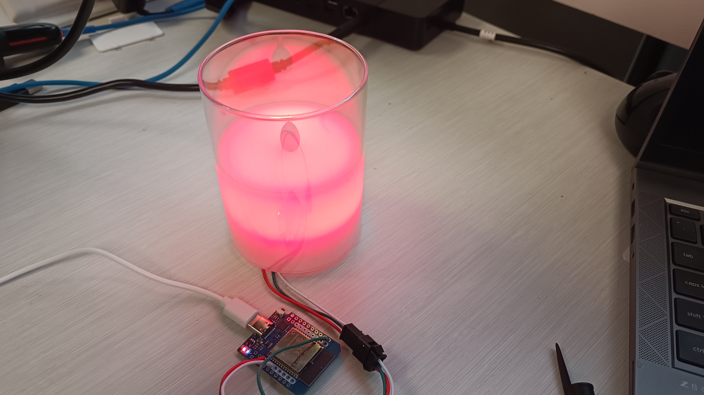

# wled-emailstatus
Check 365 Exchange mailbox using PowerShell with Graph API for spcific email type and set WLed status light to notify.

Reguires an Entra App Registration (App Management or GA permissions)
- Create "PnP Exchange Delegated Access" App Registration
- Grant Delegated App permissions for Mail.Read, User.Read

Add Presets to Wled for the new and clear status effects.

Example led status device.
Preset 1 = Chase Red
Preset 2 = Solid Green

Run the script using pwsh (I'm running it on MacOS).

This was a cheap fake candle with button cell driven led light. I removed the light and added a ring of neopixels inside.